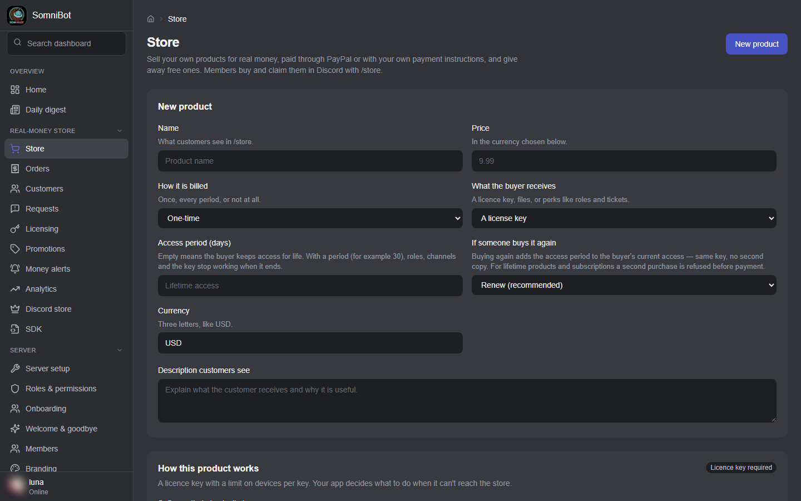

# Sell from your Discord server

[← Back to the overview](README.md) · [Features](FEATURES.md) · [Commands](COMMANDS.md)

SomniBot includes a real-money store for **digital products**, run entirely from your
Discord server and dashboard. It is completely separate from the coin economy: coins
can't buy store products, and store products never give coins.

The screenshots on this page come from a real SomniBot install with sample product
names.

## How buyers pay

- **Through your own PayPal account**: card and PayPal payments, and subscriptions.
  The money goes to you; SomniBot connects to your own PayPal apps.
- **Your own way**: for payments PayPal can't take (crypto, Cash App, a bank
  transfer…), a product can be **paid by hand**. Buyers see your payment instructions
  privately, pay you, and add their transaction ID. You get a **Payment to confirm**
  alert, press **Mark paid**, and the bot delivers the order exactly as for a PayPal
  sale. Unpaid orders close on their own after the number of days you set.
- **Free**: free products are claimed instead of bought, once per customer or
  repeatedly.

A store that sells only free products and products paid by hand needs no PayPal at all.

## What you can sell

- **Programs that check the buyer's Discord account.** Discord is the licence. Every
  time your program starts, it signs the buyer in with Discord and checks that they are
  in your server and hold the product's role, so a refund, a chargeback or a lapsed
  subscription ends access at the next start. Each buyer activates each PC once, in the
  customer portal. You choose how many PCs one buyer may use and how long an activation
  lasts. A PC that is already activated keeps running if your store is briefly
  offline. Only you and the staff you allow can free a buyer's PCs (**Reset PCs**).
  There are no licence keys to hand out, rotate or lose.
- **Downloadable files**. Buyers download from the customer portal with a private link
  that works once, and only while they own the product. **PDFs, images and text files
  get a watermark made for each buyer.** Publish a **new version** with release notes,
  and announce it in a channel, by DM to buyers who asked for updates, or both.
- **Discord perks**: roles and channels given while the purchase is active, and removed
  after a refund or revocation.
- **Service tickets**: a private ticket opened with every purchase.
- **Game items** given with a purchase.
- **Subscriptions**: plans billed every so many days, weeks, months or years, with free
  trials, through PayPal.
- An optional **access period** (for example 30 days), after which roles and channels,
  and with them access to a program, stop working.

## Buying, inside Discord

Members open `/store`, see the products on sale, and press **Buy** (or **Claim** for a
free product). Coupons: buyers press **Use a code**, see privately what it takes off,
then buy; the bot checks every rule again at that moment.

With **Gifting** on, a **Gift** button lets a buyer pick another member of the server
to give a product to (not for products you take payment for by hand). With **Announce
purchases** on, the bot posts "someone just bought..." in a channel you choose.

Everyone who owns something can get your **Customer role**, and loses it when they no
longer own anything. Use it for customer-only channels.

## Nothing goes on sale untested

Every product passes a **Sandbox check** before it can go on sale. You make a test
purchase with test money (or claim it, or mark a by-hand order paid), check what arrived
(the receipt DM, the roles, each file, or your program signed in with the Discord
account that bought it), take it back, and SomniBot reads the
real records to confirm every step happened. Change a product's price, roles, files or
delivery later and it needs a new test.

Going live with real money is a deliberate switch, and while the store is in Sandbox,
the customer portal and receipts say so.

## The customer portal

Each store has its own customer portal, in your brand, opened with `/portal` and signed
in with Discord. Buyers find:

- **Licences**: the programs they bought and the PCs they activated them on, with how
  to activate a new one. Buyers can see their PCs but not remove them, so when they run
  out they ask you to reset them;
- **Downloads**: their files, new versions marked as new;
- **Orders**: their order history, payment instructions for orders paid by hand,
  cancelling a subscription (if you allow it), and **Request a refund** or **Contact the
  seller**.

A request never moves money by itself: it reaches you at once and you decide.

## Orders, refunds and access

- **Orders** lists every order with where it came from (a purchase, a giveaway prize, a
  free claim, an automation, or paid by hand), with filters for delivery problems,
  disputes, refunds and more.
- **Refund** asks PayPal to refund the order. Access is removed only once PayPal has
  completed the refund, and it never issues a second refund. Or choose to
  remove access first and refund in PayPal yourself.
- **Refund & Cancel** on a subscription cancels it at PayPal so it can never bill again,
  refunds its latest payment and removes access.
- Refunds made directly in PayPal are handled the same way. A PayPal dispute marks the
  order **Disputed** and alerts you.
- A failed delivery shows on its order, with **Retry delivery**.
- You can also refund from Discord, inside the buyer's ticket.

## Keeping track

- **Money alerts**: every sale, refund, dispute, failed delivery, fraud signal and payment
  to confirm, sent to you in Discord, and whether each one reached you. Urgent ones always
  reach your DMs.
- **Customers**: each buyer's timeline (commerce, support and moderation), their portal
  sign-ins, which you can revoke, and the PCs they activated your programs on, with
  **Reset PCs**.
- **Requests**: refund and help requests from the portal.
- **Fraud controls**: suspicious purchases SomniBot noticed, and the rules it uses to
  notice them.
- **Analytics**: how your products sell.
- **Promotions**: coupon codes for a percentage or a fixed amount off one-time products,
  with minimum purchase, maximum uses, start and end dates, and first-purchase-only.
- **Discord store**: link premium roles you sell through Discord's own store to your
  server.
- **SDK**: describe your program and SomniBot writes the instructions a developer, or an
  AI coding assistant, follows to add the Discord check to the program you already have:
  four files covering the Discord sign-in, the role check, PC activation and every
  message the program shows. The program asks Discord itself; your store is only asked
  to activate a PC and whether it is still allowed. Nothing on that page changes your
  store.

---

[← Back to the overview](README.md) · [Features](FEATURES.md) · [Commands](COMMANDS.md)
